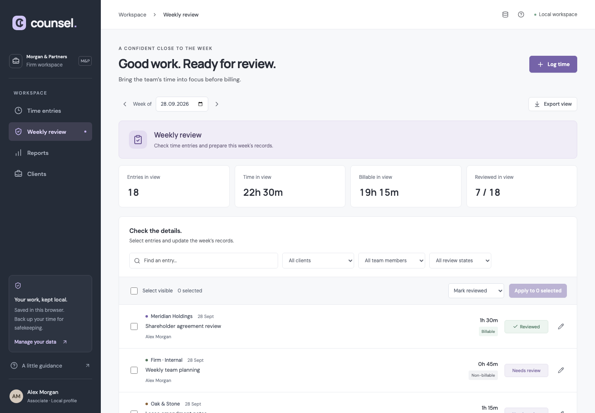

# Counsel

A local workspace for law-firm time tracking and weekly billing review.

Start with [the handover brief](ASSESSMENT.md). Every ask in it is indexed, with status, in [docs/REQUIREMENTS.md](docs/REQUIREMENTS.md). This repository represents an existing product in a fictional customer pilot. All names and records are fictional. Some workflows are unfinished; the reports in the brief are the starting point for your investigation.

## Run locally

Requires **Node.js 22.12+** (Node 24 recommended) and npm. No accounts, environment variables, API keys, or backend services are needed.

```sh
npm ci
npm run dev
```

Open the URL printed by Vite (normally http://127.0.0.1:5173).

To load the supplied workspace:

1. Open **Manage data** (database icon in the top bar).
2. Choose **Open pilot workspace**, then **Replace and restore**.
3. Open **Weekly review**. The pilot week is **28 September–4 October 2026**.

The fixture also contains the previous week. Its dates are fixed so everyone investigates the same records, regardless of the current date. Reopening the pilot workspace replaces your local records after confirmation. Download a backup first if needed.



## Checks and production build

```sh
npm test                 # Unit tests
npm run build            # TypeScript check and production build
npm run check            # Unit tests and build
npx playwright install chromium
npm run test:e2e          # Desktop and mobile Chromium flows, including axe checks
npm run preview          # Serve the production build locally
```

Browser tests start their own server on port 5177; leave that port free. The mobile project emulates a phone in Chromium; it is not a test of native Safari. CI installs the browser automatically. Existing checks cover established workflows; passing them is not a guarantee that the reported customer issues are resolved.

## Product structure

- `src/App.tsx`: workspace, navigation, forms, and data management.
- `src/components/ReviewPage.tsx`: weekly review, selection, actions, and export.
- `src/review.ts`: review queries, entry operations, re-review rules and conflict-safe undo.
- `src/useTheme.ts`: light/dark theme (system default, remembered choice).
- `src/model.ts`: data types, validation, dates, totals, and CSV.
- `src/useStore.ts`: browser persistence and storage events.
- `src/fixtures/pilot-workspace.json`: restorable fictional pilot workspace.
- `src/components/`: shared UI and forms.
- `tests/`: browser smoke and accessibility checks.

The app uses React, TypeScript, Vite, Lucide icons, and locally bundled fonts. Dates are local calendar dates, durations are integer minutes, and weeks run Monday through Sunday. All new entries use a mock Alex Morgan profile; the fixture includes other team members for review.

## Data and scope

Records persist in localStorage under `counsel.time.v1` on this origin. A different port/browser/device has separate data. Clearing browser storage removes records. JSON backups include all clients and entries; CSV exports are intended for the current view. There is no authentication, cloud sync, invoicing backend, real customer data, or analytics. The `reviewed` field is optional for compatibility with earlier backups.

This is a small local pilot, not a multi-user server or immutable billing ledger. Keep changes within that scope. You may add tests and dependencies if useful, but no paid services should be required to run the submission.

## Submission

Create an empty public GitHub repository on your own profile, paste its URL in the Attack portal, and start your 90-minute session to download this starter. Work in that repository. Push your changes to the agreed branch, complete [HANDOVER.md](HANDOVER.md), and submit your full commit SHA and short handover in the Attack portal before its timer expires. See the brief for the timebox and review format. Keep your repository public on your profile so reviewers can access the submitted commit.
